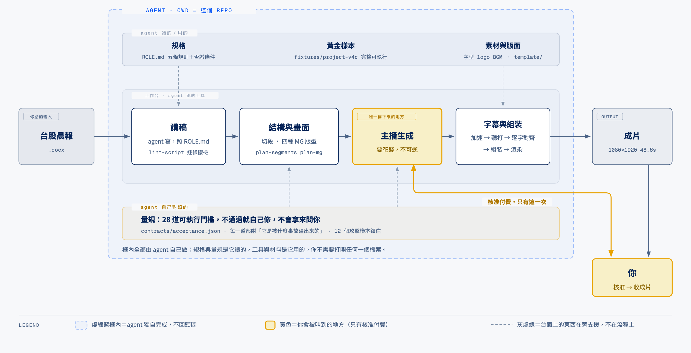

# morning-brief-workbench

**要解決的問題**:每天一支台股晨報短影音——做一支不難,做穩很難。
第一支真正對的花了六個版本、四輪人眼 audit,而產線本身不知道它為什麼好,
下一支可能在十幾個維度裡的任何一個悄悄退化。

**這個工作台做的事**:把「什麼叫做得夠好」寫成 28 道可執行的門檻,
把那支通過驗收的影片完整留成可執行的黃金樣本,讓 agent 走過來一口氣做完下一支。
**中間只有一道人工關卡:核准付費的主播生成。**



**這張圖怎麼看**：**虛線藍框內全部是 agent 在做。** 你交出一份晨報，agent 在框裡讀規格、
跑工具、用材料、對照量規，一路做到成片。**它只會在一個地方叫你——主播生成那一步**，
因為那要花錢而且不可逆。其餘任何不確定它都自己判斷後繼續，不會回頭問。

台面上那三層（規格／材料／量規）**都是 agent 讀的與用的，不是給你看的**。
你不需要打開任何一個檔案，除非你想改規則——那時才去動 `ROLE.md`。

---

## 為什麼會做不穩

2026-08-26 那支通過驗收的影片,被人眼抓出來的是這些:
頂欄壓住主播的頭、標題板與 B-roll 同色、主播的手一直上下擺、字幕以句號結尾、
B-roll 早於語音、第一格素材蓋掉問候。

**而更早那一支是完全照規格做的,也通過了規格自己的交稿前檢查,卻被評「平鋪直述、沒有 hook」。**
所以問題不在執行,在**規則本身沒有把「什麼叫好」寫下來**。
## 這個工作台怎麼解

把三樣東西攤在同一張台面上,agent 走過來就能開工:

- **規格** — `ROLE.md` 五條規則,每條附機制與**否證條件**。它是拿來改的,不是拿來遵守的。
- **量規** — 28 道可執行門檻,**每一道都附「它是被什麼事故逼出來的」**。
  數字誰都能猜,失敗紀錄不能。
- **樣本** — `fixtures/project-v4c/` 是那支通過驗收的完整可執行專案;
  另有 12 個**攻擊樣本**,是曾經騙過門檻的壞輸入,現在被測試鎖住。

**中間只有一道人工關卡:核准付費的主播生成。** 其餘不停——中間產物有量規在管。

一支成品:48.6 秒、1080×1920、9 格(主播與素材嚴格交替)、22 段字幕、素材覆蓋率 44%。

## 與 marketing-video/app 的關係

**兩個等價、互不依賴的實作。** 同一個目標、不同的取捨:那邊素材與工具齊全但耦合較多,
這邊是拿一支通過驗收的成品重做的乾淨版。

發現對方的方向或產出好就**抄**過去——不引用、不 symlink、不讀對方的路徑。
兩邊各自持有一份素材、一份規格、一份金鑰。

> **為什麼叫工作台。** 工具、材料、作業方法攤在同一張台面上，人或 agent 走過去就能開工，
> 不必知道工廠其他地方有什麼。`contracts/` 那 28 道門檻是台面上的**量規**——
> 量規本來就是工作台的標準配備，不是另一件東西。
>
> 原本叫 harness。軟體界的 harness 是 test harness，重心在「檢查」而不在「產出」，
> 而那個字讓這份 README 的第一版把「還沒搬過來的階段」寫成了「這裡不做」。
> 換掉它不只是好聽。

## 跑起來

需要 Node 24。demo 不需要網路、不呼叫任何付費 API。

```bash
npm install --no-package-lock && npm run demo
```

```
台股晨報工作台　·　黃金樣本 vs 攻擊樣本
──────────────────────────────────────────────────────────────────
黃金樣本  project-v4c            通過 22　未通過 0
          （2026-08-26 實際出片的那一支，48.6 秒）

攻擊樣本  x12-grandslam          通過 10　未通過 14
          （強化之前，這一支是 19 道全過、exit 0）

  ↳ ledger.duration-in-target      300s（目標 42–55s）
  ↳ ledger.coverage                0.087
  ↳ plan.matches-ledger            格 01 form mg≠presenter
  ↳ mg.prompt-provenance           04 與 02 的 output 完全相同
──────────────────────────────────────────────────────────────────
```

刻意做成對照。只跑黃金樣本會看起來像「所有測試都會過的專案」，看不出門檻真的會擋。

接著：

```bash
npm run gates -- --project fixtures/project-v4c    # 完整 28 道
npm run plan  -- --project fixtures/project-v4c    # 從講稿推導切段
npm run lint:script fixtures/project-v4c/script.txt # 講稿的機檢
npm test                                            # 32 個回歸測試
```

## 契約，以及它是被什麼事故逼出來的

門檻全部定義在 [`contracts/acceptance.json`](contracts/acceptance.json)，一處定義、多處引用。
每一道有 `rule`、`observed`（黃金樣本量到多少）、`threshold`，以及 `counterexample`。

| 門檻 | 黃金樣本 | 它擋的那次事故 |
|---|---|---|
| `ledger.coverage` | 0.44 | V2 是 **0.969**，主播只露臉 1.85 秒 |
| `ledger.invariants` | 9 段成立 | 有人把第 10 格宣告成長度 **−4.576s**，真實 64.9% 的覆蓋率被報成剛好 0.440 |
| `ledger.duration-in-target` | 48.6s | 一支 **300 秒**的片子，覆蓋率 0.087 在報告上比黃金樣本更好看 |
| `caption.char-coverage` | 236/236 | 字幕 `text` 是空字串、`cleanCharCount` 湊到 236，舊版報「236/236 通過」 |
| `caption.no-trailing-punct` | 0 | 句號後加一個半形空格就放過，10 個變體 9 個放過 |
| `mg.prompt-provenance` | 4 格互不相同 | 四格 B-roll 指向**同一張 90 bytes 的 1×1 黑 PNG**，報「全部配對」 |
| `avatar.payload-locked` | 逐欄相符 | **16:9 480p**、稿子是別支影片的 payload，通過了付費前唯一的檢查 |
| `script.lint-clean` | 0 error | lint 有 18 個 error id，舊版只有 5 個到得了 gate |
| `ledger.greeting-uncovered` | 落在 presenter 段 | HOOK 裡塞一個「早安」，真正的問候被滿版圖表整段蓋住而報通過 |

背後是七條原則，寫在 [`PIPELINE.md`](PIPELINE.md)：

1. 缺必要 artifact 是 failed，不是略過——空目錄曾經拿到最乾淨的報告
2. 講稿層看整份 lint 的 error 數，不逐項對應——加規則時不會有人記得同步加 gate
3. 時間軸要有不變量——沒有它，覆蓋率可以用負數段長湊成任何值
4. 從內容量，不讀 artifact 自己宣告的數字
5. 空集合不算通過——單段 ledger、0 個素材格、0 個切點、`0/0` 一律 failed
6. 每個門檻都要有上下界——只有下界時「全片上圖、主播不露臉」通過得比黃金樣本漂亮
7. provenance 必要而非自願——手寫 artifact 天生沒有 sidecar，那正是最可疑的一類

`fixtures/attacks/` 收了 12 個攻擊樣本當回歸測試。斷言的不只是「有擋下」，
還包括「是哪一道 gate 擋的」——否則某天換個理由失敗，測試會繼續綠燈而漏洞已經回來。

## 產生器

不只是驗收。從一份新講稿推導出結構與畫面：

**`plan-segments.mjs`｜切段** — 分句是唯一的切點單位（黃金樣本那 9 個切點實測全部落在分句邊界）。
在此之上用 DP 找滿足全部門檻的分割，並在語速區間兩端各驗一次——只在中點成立的計畫，真音檔一到就破。

搜尋空間 2²⁸ 種分割 → **229 種結構合法** → 一個兩分句的編輯 hint → **唯一解**，
而那一個就是黃金樣本（9/9 格 form 與 anchor 全同）。

它不猜編輯意圖。逐分句分類器在真實資料上就對不起來：帶數字的分句是主播（HOOK）、
帶疑問的是素材（觀察條件）、帶列舉的兩者都有。那些是編輯判斷，不是文字特徵的函數。

**`plan-mg.mjs` ＋ `mg-templates.mjs`｜畫面** — 手寫的四格其實是四種反覆出現的資訊形狀：

| 版型 | 用在 | 選型規則 |
|---|---|---|
| `stat-compare` | 兩項數據對照 | 有 ≥2 筆同單位數字 |
| `chain` | 因果鏈三節加結論帶 | 其餘 |
| `gap` | 已發生 vs 未發生 | 有對比詞（不過／還沒／未） |
| `checklist` | 編號清單 | 有列舉詞（兩件事／三件） |

幾何值沿用實際過關的那組。在黃金樣本上選型 **4/4 正確**，抽取的資料與手寫版幾乎逐字相同，
生成的四格與手寫的四格在 `hyperframes check` 下同為 0 error。

## 怎麼寫講稿

[`ROLE.md`](ROLE.md) 是短影音變體的規則，對上游的文字晨報規則有五處刻意偏離。
每一條都附機制與**否證條件**——那份文件是拿來改的，下一次迭代從那裡下手。

核心是一個定義：**轉折 ＝ 段落 N+1 使觀眾改變對段落 N 的判斷。**
只是補充新事實不算。改版前那一支的中段轉折數是 0，HOOK 在第 16.96 秒；
黃金樣本是 4 個轉折、HOOK 在第 0 秒。

規則 A–E 都還沒用留存數據驗證，依據是一次外部 audit 的回饋、一組結構性量測、
以及資訊落差理論（Loewenstein 1994）。

## 人在哪裡介入

三個地方，其餘不停：

1. **寫講稿** — lint 立刻回饋，但字是人寫的
2. **兩句 plan hint** — 哪幾句必須在主播臉上。結構有 229 種合法解，這兩句釘成一個
3. **授權付費** — dry-run payload 出示，點頭才呼叫

`responsibility`（每個素材格要承擔什麼）一律留空給人填。那是 B-roll prompt 的依據，
屬編輯意圖——**結構是機器的事，意圖是人的事。**

## 目錄

```
ROLE.md      講稿寫作規則：五條規則，每條附機制與否證條件
contracts/   28 道門檻與主播生成的鎖定 payload；一處定義
stages/      13 個階段，各做一件事，吃 --project <dir>
template/    版面契約（brandWash、程式畫開場卡、標題板、字幕）
fixtures/
  project-v4c/   黃金樣本，完整可執行
  attacks/       12 個攻擊樣本，回歸測試用
test/        32 個測試
```

版本用**目錄**分，不用檔名後綴。`resolveProject()` 遞迴掃到任何 `.vN` 檔名就拒絕執行——
起因是一次真實事故：某支腳本讀死 `segment-ledger.json`，而當時的 writer 寫的是
`segment-ledger.v4.json`，於是它靜默讀到還留在原地的舊版 12 格表，MG 長度全錯。

每個產出的 artifact 都有一份 sidecar 記錄輸入的 SHA-256，下游驗證後指名要重跑哪一階段。
